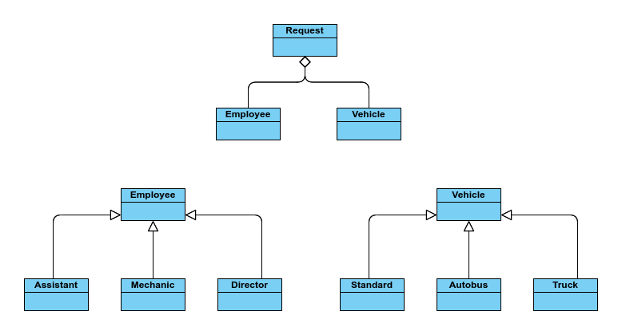

## AutoService - Marius-Augustin Niţu, ACS 2023

AutoService is a console-based application in C++ applying Object-Oriented Programming principles by designing
and implementing classes to efficiently handle various aspects of a management system.

With a specific on inheritance, the projects is made of three esential classes (Employee, Vehicle, Request) and their relationships can be observed in the oversimplified class diagram.

### Employee
* Inheritance - the parent class of Assistant, Mechanic, Director.
* Implemented methods in order to execute simple operations such as adding, modifying or removing an employee into the system.

### Vehicle
* Inheritance - the parent class of Standard, Autobus, Truck.
* Implemented methods in order to calculate insurance for a vehicle based on its characteristics.

### Request
* Aggregation - include the aforementioned classes Employee, Vehicle.
* Implemented methods in order to create a Waiting Queue. The customers requests are recorded and managed by the system.
* Additionally, as a result, statistics are recorded by the system and available to display in the Menu.

### Further Notes
* The project purpose is educational, first and foremost. 
* The instructions and requirements are included into the repository.
* Course Object-Oriented Programming, ACS IS 2023. 